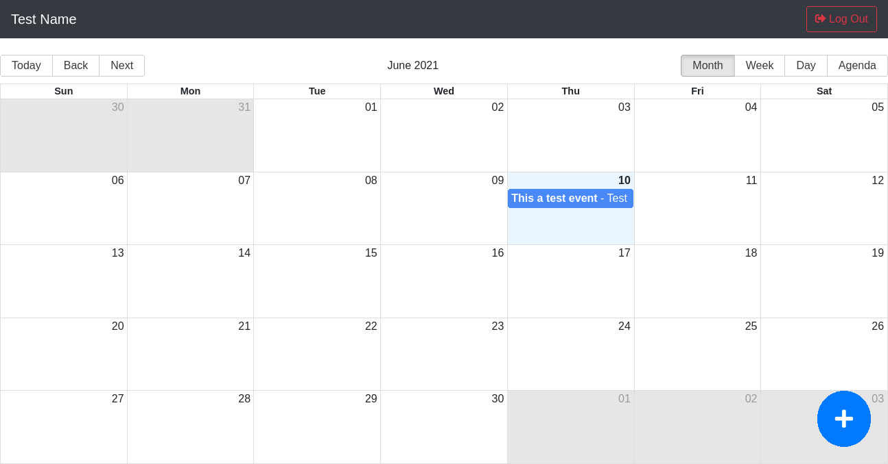
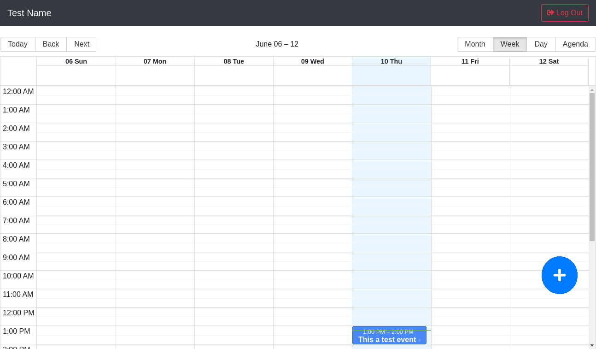
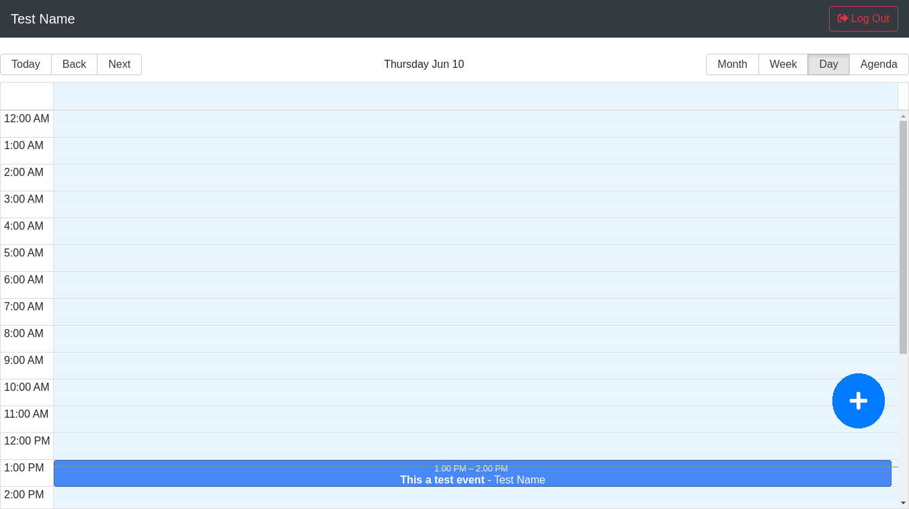
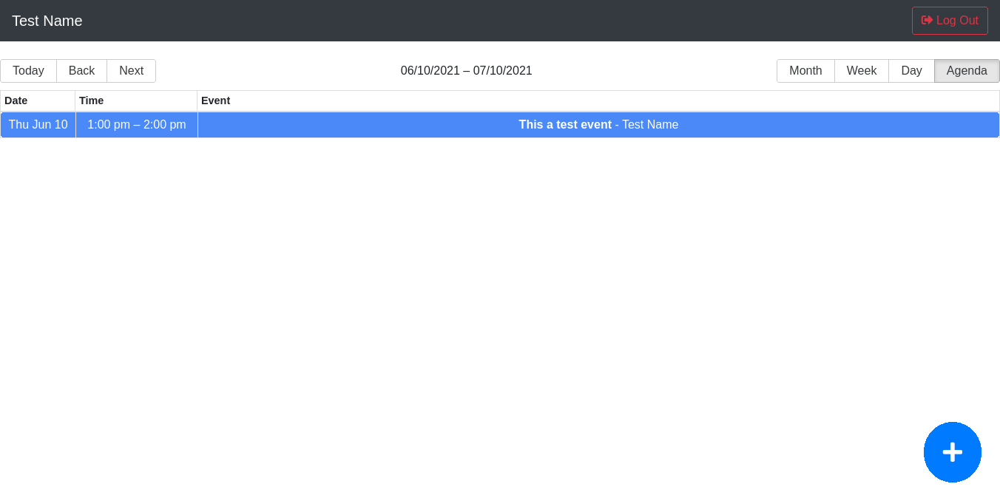

# Calendar React

This is the front end of a MERN app, for this project I used the `big calendar` library and implemented Redux Thunk.
It's a simple calendar app where you can create, edit and delete events. You need to create a user in order to use the app or use the default
credentials that are already on the login within the app. This app is only for educational purposes.

You can find the API repo here: https://github.com/bernardogarza/calendar-react-api

## Author

**[Bernardo Garza Landa](https://bernardogarza.me/)** - bernardo.g.landa@gmail.com - [Portfolio](https://bernardogarza.me) - [LinkedIn](https://www.linkedin.com/in/bernardo-g-landa/)

## Live Demo

<a href="https://calendar-app-bg.netlify.app" target="_blank">https://calendar-app-bg.netlify.app</a>

 
 

<h1 align="center">Screenshots</h1>

  

  

  

  

 
 

## Available Scripts

In the project directory, you can run:

### `yarn start`

Runs the app in the development mode.\
Open [http://localhost:3000](http://localhost:3000) to view it in the browser.

The page will reload if you make edits.\
You will also see any lint errors in the console.
